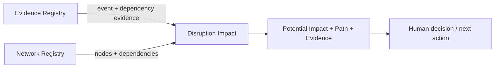

# Product / Technical Gap Baseline

Evidence base: repository main `11f3e0f191d7f5a30e1bb0512d26e0db323f38e2` was a bootstrap README only; this writer branch introduces the first test-first disruption-impact vertical. Status must be revalidated against the PR's current exact head before merge.

## Feature specification now implemented

Observed evidence-backed disruption + evidence-backed dependency facts → validate source/node invariants → traverse explicit downstream dependency edges → return unique potential impacts ordered by shortest hop count and semantic key, each with originating event evidence, a deterministic shortest dependency path, and per-edge source evidence. No heuristic score is produced.

## Commercialization gaps

| Gap | Owner | Evidence | Action | Current status | Next verification |
| --- | --- | --- | --- | --- | --- |
| Durable temporal network/evidence store | this repo | in-memory aggregate only | implement 3NF persistence with semantic keys, temporal validity, immutable evidence and item-level UPSERT/idempotency | open | concurrency + migration + recovery tests |
| Evidence-linked path explanation | this repo | `ImpactRecord.event_evidence`, `dependency_path`, `dependency_evidence`, cycle and equal-length multi-route regression tests | preserve deterministic shortest path and evidence alignment | implemented on writer branch | exact-head CI/review; quantitative coverage proof |
| Real source ingestion | adapter boundary; causal source repos if reusable | no connector exists | add EPCIS/ERP/WMS/TMS ACL adapters using real non-synthetic contract fixtures | open | interoperability + malformed-input tests |
| Authn/authz and tenant isolation | this repo + ecosystem identity boundary | no network API | define workspace ownership, authorization and audit before external access | open | security tests + threat model |
| Operability | this repo | no service/container/release | add compose-compatible service only when API exists; health/metrics/backup/restore and resource tuning | open | failure-injection + restore evidence |
| Customer workflow / UX | this repo | no UI | design evidence drill-through and next-action workflow without exposing internal boundaries | open | accessibility/E2E/screenshots + realistic load |
| Quantified severity/recovery scenarios | dedicated validated Rust model boundary | only reachability is justified | select/derive model from authoritative evidence; encode constraints and uncertainty, never rule-of-thumb weights | open | validation dataset + calibration/model tests |
| Release/provenance/license | this repo + central workflows + product owner | no release and no explicit repository license decision exists on `main` | make an explicit licensing decision, then define public artifact, SBOM/provenance and changelog release gate | open | license file/package metadata + signed/versioned release evidence |
| Quantitative coverage evidence | this repo | behavioral tests cover core branches/accessors but no coverage artifact exists | adopt the org's pinned Rust coverage toolchain before claiming 100% | open | exact-head coverage artifact |

## DDD state

Core: Disruption Impact. Supporting: Network Registry, Evidence Registry. Generic: identity/audit/transport/observability. The current aggregate is `SupplyGraph`; entities/value objects are supply nodes, evidence-backed dependency facts, supply events, evidence references and impact records. Domain service behavior is deterministic downstream reachability plus evidence-linked shortest-path explanation. Invariants are documented in PRD/architecture and enforced by tests.
