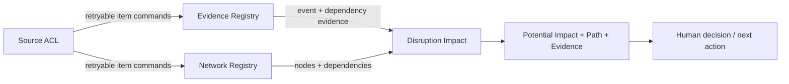

# Product / Technical Gap Baseline

Evidence base: repository main `11f3e0f191d7f5a30e1bb0512d26e0db323f38e2` was a bootstrap README only; the open pull request introduces the first test-first disruption-impact vertical. The PR metadata and writer-branch ref are the authority for its current exact head, checks, reviews, and merge state.

## Feature specification now implemented

Observed evidence-backed disruption + evidence-backed dependency facts → validate source/node invariants → admit new facts or accept only exact ingestion replays → traverse explicit downstream dependency edges → return unique potential impacts ordered by shortest hop count and semantic key, each with originating event evidence, a deterministic shortest dependency path, and per-edge source evidence. No heuristic score is produced.

Replay semantics are explicit at the Rust boundary: node, dependency, and event upserts return `Inserted` when absent, `Unchanged` for an exact semantic replay, and an explicit conflict when an existing semantic identity is paired with changed immutable content. Strict add commands continue to reject duplicate identities. This is the command contract future durable writers must preserve; it is not itself database durability evidence.

## Commercialization gaps

| Gap | Owner | Evidence | Action | Current status | Next verification |
| --- | --- | --- | --- | --- | --- |
| Durable temporal network/evidence store | this repo | in-memory aggregate only; replay-safe item upsert semantics are implemented and regression-tested in Rust | implement 3NF persistence preserving exact-replay/no-op and changed-content/conflict semantics, temporal validity, immutable evidence and one-item transaction boundaries | open; domain idempotency contract implemented on writer branch | exact-head Rust checks, then concurrency + migration + recovery tests for persistence |
| Evidence-linked path explanation | this repo | `ImpactRecord.event_evidence`, `dependency_path`, `dependency_evidence`, cycle and equal-length multi-route regression tests | preserve deterministic shortest path and evidence alignment | implemented on writer branch | exact-head central checks + independent review |
| Replay-safe item ingestion contract | this repo | `UpsertOutcome`; `upsert_node`, `upsert_dependency`, `upsert_event`; exact-replay/conflict/invariant regression tests | require future adapters and database command handlers to preserve these semantics; never convert conflicts to last-write-wins | implemented on writer branch | exact-head Product CI/coverage + independent review |
| Real source ingestion | adapter boundary; causal source repos if reusable | no connector exists | add EPCIS/ERP/WMS/TMS ACL adapters using real non-synthetic contract fixtures and the replay-safe item command contract | open | interoperability + malformed-input + replay tests |
| Authn/authz and tenant isolation | this repo + ecosystem identity boundary | no network API | define workspace ownership, authorization and audit before external access | open | security tests + threat model |
| Operability | this repo | no service/container/release | add compose-compatible service only when API exists; health/metrics/backup/restore and resource tuning | open | failure-injection + restore evidence |
| Customer workflow / UX | this repo | no UI | design evidence drill-through and next-action workflow without exposing internal boundaries | open | accessibility/E2E/screenshots + realistic load |
| Quantified severity/recovery scenarios | dedicated validated Rust model boundary | only reachability is justified | select/derive model from authoritative evidence; encode constraints and uncertainty, never rule-of-thumb weights | open | validation dataset + calibration/model tests |
| Source licensing | this repo + product owner | root `LICENSE` and Cargo metadata on writer branch declare Apache-2.0; protected `main` has not integrated them yet | preserve Apache-2.0 source grant and keep future inbound code/assets commercially compatible | implemented on writer branch | exact-head checks/review + protected integration |
| Immutable release / SBOM / provenance | this repo + central workflows | no release or signed artifact exists | define public artifact, SBOM/provenance, checksums/attestation and changelog release gate without treating source licensing as release evidence | open | signed/versioned release evidence |
| Quantitative coverage evidence | this repo | Product CI enforces 100% line, function, and region coverage on stable Rust plus a nonzero 100% branch denominator on pinned nightly Rust | preserve the version-pinned gates and fail on zero denominators | implemented workflow; latest code requires fresh exact-head evidence | exact-head Product CI + central checks + independent review |

## Licensing due diligence

The repository was initialized in ContextualWisdomLab as an independent root commit and the foundation branch contains repository-authored Rust, tests, workflows, and documentation rather than imported/vendored source. The current crate has no third-party runtime dependencies. Under the organization commercial-use policy, the writer branch therefore grants the repository source under Apache License 2.0 and declares `license = "Apache-2.0"` in `Cargo.toml`.

That source grant does not manufacture release, deployment, customer, certification, transfer, SBOM, provenance, or third-party-license evidence. Any future dependency, copied source, generated asset, model artifact, or external adapter must be re-evaluated for inbound provenance and commercial compatibility before incorporation.

## DDD state

Core: Disruption Impact. Supporting: Network Registry, Evidence Registry. Generic: identity/audit/transport/observability. The current aggregate is `SupplyGraph`; entities/value objects are supply nodes, evidence-backed dependency facts, supply events, evidence references, replay outcomes and impact records. Domain service behavior is deterministic downstream reachability plus evidence-linked shortest-path explanation. Invariants include immutable evidence, strict duplicate rejection for non-replay commands, exact-replay idempotency for upsert commands, conflict rejection for same-key changed content, cycle-safe traversal and deterministic route selection. Durable transaction/concurrency semantics remain a persistence gap rather than a claimed property of the in-memory aggregate.
